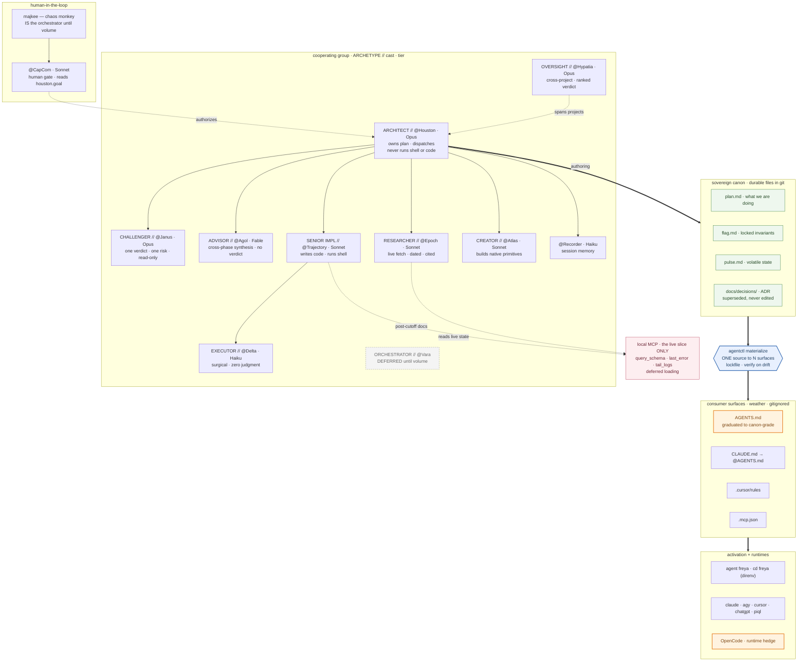

# Agentive System — the bigger picture

_Drawn from `the-team_doctrine-v2.md` (archetypes) + `team-roster.md` (live cast), as the future build. Orange = the deltas we derived this session, not yet in canon._

## How to read it

- **Top band — the human gate.** majkee is the orchestrator until volume forces @Vara into existence (deferred, dashed).
- **Middle band — the team.** Each seat is `ARCHETYPE // live-cast · tier`. The doctrine owns the left of the `//`; the roster owns the right. Solid arrows = dispatch; dotted = authorize / span. The architect never holds the wrench.
- **Lower bands — the one-direction flow (force 4).** Authoring → **canon** (plan/flag/pulse/decisions) → **the gate** (`agentctl`) → **surfaces** (weather, gitignored) → **runtimes + commands**. Intelligence flows down only.
- **The live slice (pink), off to the side.** Not in the canon flow — the implementer and researcher read it directly for runtime truth. This is the Model-C remainder, still unsized.

## The four future deltas marked here

1. **AGENTS.md graduated** (orange) — moved from vendor-weather to canon-grade; needs the graduation rule added to the file plane.
2. **agentctl gate** — your materializer as the single compile-down, superset of the report's Ruler.
3. **OpenCode hedge** (orange) — runtime fallback against a Gemini-style rug-pull.
4. **Deferred-loading on the live MCP** — the fix for F3 (global servers bloat every session).
