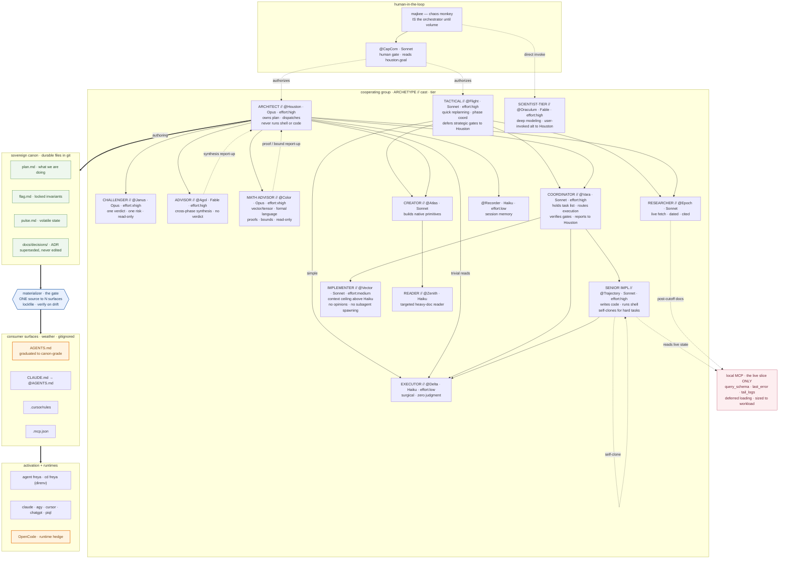

# Agentive System — the bigger picture (v3)

_Drawn from `doctrine.md` (archetypes) + `roster.md` (live cast). Orange = deltas not yet in canon. v3: @Vara activated (execution coordinator between Houston and implementation layer); @Vector added (mid-tier implementer); @Agol model corrected Fable→Opus. Decision 0006 (2026-06-25). v4: @Flight seated (Sonnet · effort:high) — tactical planner, Houston-family lightweight seat, 2026-06-27. v5: @Hypatia retired → @Oraculum seated (Fable · effort:high) — scientist-tier, user-invoked Houston alternative, 2026-07-02._



## Dispatch hierarchy

Text companion to the diagram. Read: *who spawns whom, and when*.

```
majkee
  ├─ @Oraculum (Fable · high)            ← direct invoke; scientist-tier, deeper than Houston
  └─ @CapCom (Sonnet · high)             ← human gate; reads houston.goal, assesses risk, awaits "ano"
       ├─ @Houston (Opus · high)          ← strategic work; architect, owns plan, locks decisions
       │    ├─ (see full Houston subtree below)
       └─ @Flight (Sonnet · high)         ← tactical work; quick replanning, execution coordination
            ├─ @Vara (Sonnet · high)      ← execution coordinator; routes Trajectory/Vector/Delta
            ├─ @AtlasAuto (Sonnet)        ← primitive creator; clear spec only
            ├─ @Epoch (Sonnet · medium)   ← researcher; date-calibrated fact checks
            └─ @Delta (Haiku · low)       ← direct dispatch for simple surgical tasks

@Houston (Opus · high)         ← after confirmation; architect, owns plan
            ├─ @Janus (Opus · xhigh)     ← challenge-before-lock; adversarial; spawned for any big decision
            ├─ @Agol  (Fable · high)     ← synthesis advisor; spawned when cross-phase reasoning needed
            ├─ @Color (Opus · xhigh)     ← math/formal-language co-brain; spawned for proofs/bounds/semantics
            ├─ @Epoch (Sonnet · medium)  ← researcher; spawned for live version/stack checks
            ├─ @Atlas (Sonnet · high)    ← primitive creator; spawned to build/repair agents
            ├─ @Recorder (Haiku · low)   ← memory librarian; spawned to file session state
            └─ @Vara (Sonnet · high)     ← execution coordinator; spawned when a plan enters execution phase
                 ├─ @Trajectory (Sonnet · high)   ← senior impl; spawned for complex/judgment tasks
                 │    └─ @Delta (Haiku · low)      ← surgical executor; spawned for specific subtasks
                 │         [fallback: if Delta is not strong enough, Trajectory takes over directly]
                 ├─ @Vector (Sonnet · medium)      ← mid-tier impl; spawned when context > ~40K or
                 │                                    medium-complexity new code, no judgment needed
                 └─ @Delta (Haiku · low)            ← direct dispatch for simple surgical tasks
```

**Fallback rules:**
- `Delta not strong enough` → Trajectory picks up the task directly (no re-dispatch through Vara)
- `Context > 100–128K` → escalate to Trajectory from task start; do not wait for Delta to fail
- `Hard task (3+ hop debug, architecture root-cause)` → skip Trajectory, go directly to an Opus seat (Houston / Color / Janus depending on domain)
- `Advisory needed mid-execution` → Vara surfaces to Houston; Houston spawns the relevant advisor

**What Vara does NOT do:** re-plan, run Bash, or override Houston's gate decisions.
**What Trajectory does NOT do:** hold the task list across sessions (that is Vara's responsibility).

**Dispatch discipline — a Write-less seat cannot file its own mail (gaveled 2026-07-03).**
When you dispatch a seat that has **no `Write` tool** (a read-only / query seat — e.g. an MCP query agent, a read-only advisor), **the spawning session owns filing that seat's output.** Filing it is part of definition-of-done, not optional: unfiled read-only-seat output **silently evaporates** when the subagent context closes. This is the read-side mirror of 0010's *"content enters through exactly one door — a writer's own append"*: if the seat cannot write, the spawner must carry the write. *(Origin: @delta-sql's reposoma-schema impulse never reached disk — no Write tool, the filing step dropped; recovered from the session transcript by @Oraculum, 2026-07-03.)*

---

## What changed

**v2 (2026-06-24):**
- **`@Atlas → @Zenith`** added — the creator's Haiku reader was in the roster and missing from the map.
- **`@Trajectory` self-clone** kept — the senior forks for parallel perspective on a hard task.
- **`@Houston → @Delta` (trivial reads)** kept — dispatching the cheap reader is flat dispatch, not "holding the wrench."
- **"swarm" removed** — `@Agol → @Houston` stays as a synthesis report-up only.
- **`@Color` seated** — math/formal-language co-brain; `@Houston → @Color` dispatch, `@Color → @Houston` report-up. Gaveled 2026-06-24.

**v3 (2026-06-25 · decision 0006):**
- **`@Vara` activated** — execution coordinator layer between Houston and implementation. Holds task list, routes Trajectory/Vector/Delta, verifies gates, reports state. Was deferred; now canon.
- **`@Vector` added** — mid-tier implementer (Sonnet, effort:medium). Sits between Delta and Trajectory on the escalation ladder: context ceiling above Haiku or medium-complexity new code, but no judgment or subagent spawning needed.
- **Effort levels added to node labels** — model tier alone is insufficient; effort is an orthogonal quality axis (AMD/Laurenzo finding: effort-misconfig risk > tier-selection risk).
- **`@Agol` corrected Fable → Opus** — Fable 5 pulled within 48h of launch; silent self-degradation confirmed in Anthropic system card.
- **`@Janus` effort:high → effort:xhigh** — must exceed architect's reasoning depth to produce meaningful challenge-before-lock.

**v5 (2026-07-02):**
- **`@Hypatia` retired → `@Oraculum` seated** — reconfigured and renamed. Oraculum: Fable · effort:high, scientist-tier, user-invoked alternative to Houston. Same canon reading list, deeper problem-modeling phase (Phase A/B/C), neural and coding depth close to Color. Not spawned by Houston — user invokes directly. `hypatia-brief` skill retired; `agol-brief` created as its successor for Agol synthesis context handoffs.
- **`@Agol` model note updated** — Fable returned 2026-07-02; stale Opus note cleared from definition.

**v6 (2026-07-03):**
- **Dispatch discipline added — Write-less seats.** The spawning session must file a read-only seat's output as definition-of-done (see the discipline block above). Gaveled 2026-07-03 after @delta-sql's schema impulse evaporated for lack of a Write tool.
