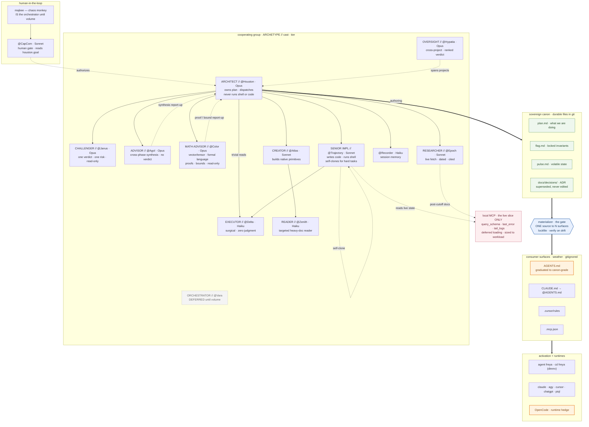

# Agentive System — the bigger picture (v2, cleaned)

_Drawn from `doctrine.md` (archetypes) + `roster.md` (live cast). Orange = deltas not yet in canon. v2 fixes: added `@Atlas → @Zenith` reader; kept `@Trajectory` self-clone and `@Houston → @Delta` (trivial reads) as doctrine-true; removed the "swarm" scope-leak, keeping `@Agol → @Houston` as a report-up._

## What changed from v1

- **`@Atlas → @Zenith`** added — the creator's Haiku reader was in the roster and missing from the map. My omission, fixed.
- **`@Trajectory` self-clone** kept — the senior forks for parallel perspective on a hard task. Not an artifact; a real pattern.
- **`@Houston → @Delta` (trivial reads)** kept — dispatching the cheap reader is flat dispatch, not "holding the wrench." The wrench is shell/app-code, not delegation.
- **"swarm" removed** — that word reached into the parked composition study; the seed says do not merge. `@Agol → @Houston` stays as a synthesis report-up (the advisor returns findings; the architect persists them).
- **`@Color` seated** — math/formal-language co-brain advisor for the Houston family; read-only like @Agol/@Janus, delegates live SOTA to @Epoch. `@Houston → @Color` dispatch, `@Color → @Houston` proof/bound report-up. Gaveled 2026-06-24.
